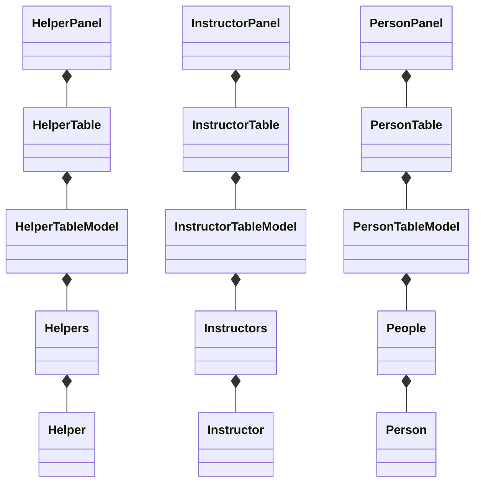
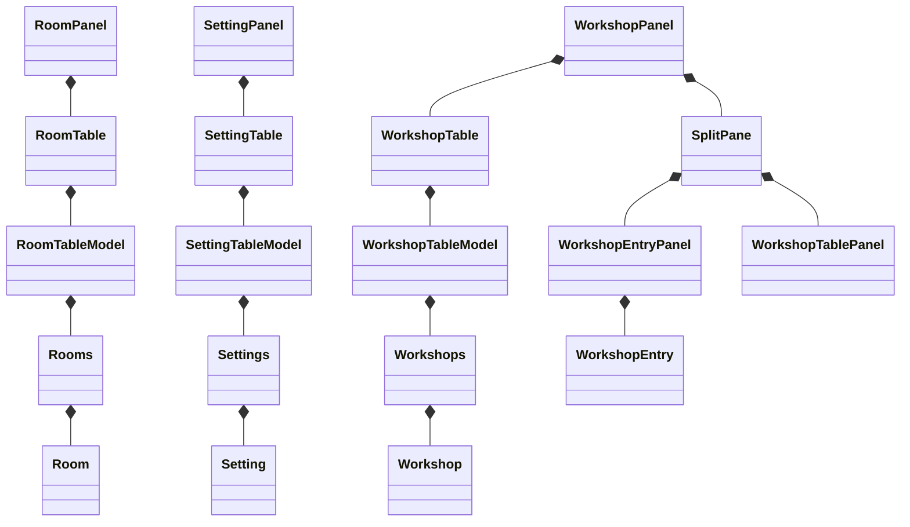
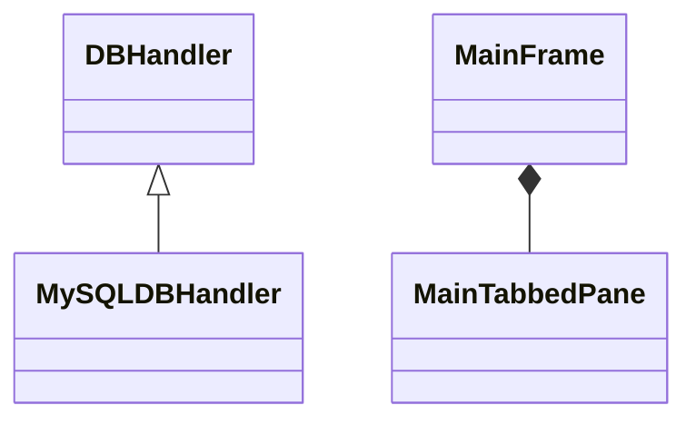

# README

```mermaid

classDiagram

    Helpers *-- Helper
    HelperTableModel *-- Helpers
    HelperTable *-- HelperTableModel
    HelperPanel *-- HelperTable

    Instructors *-- Instructor
    InstructorTableModel *-- Instructors
    InstructorTable *-- InstructorTableModel
    InstructorPanel *-- InstructorTable

    People *-- Person
    PersonTableModel *-- People
    PersonTable *-- PersonTableModel
    PersonPanel *-- PersonTable

```

```mermaid

classDiagram
    Rooms *-- Room
    RoomTableModel *-- Rooms
    RoomTable *-- RoomTableModel
    RoomPanel *-- RoomTable
    
    Settings *-- Setting
    SettingTableModel *-- Settings
    SettingTable *-- SettingTableModel
    SettingPanel *-- SettingTable

    Workshops *-- Workshop
    WorkshopTableModel *-- Workshops
    WorkshopTable *-- WorkshopTableModel
    WorkshopPanel *-- WorkshopTable
    WorkshopEntryPanel *-- WorkshopEntry
    SplitPane *-- WorkshopTablePanel
    SplitPane *-- WorkshopEntryPanel
    WorkshopPanel *-- SplitPane
```

```mermaid
classDiagram
    DBHandler <|-- MySQLDBHandler
    
    MainFrame *-- MainTabbedPane
```