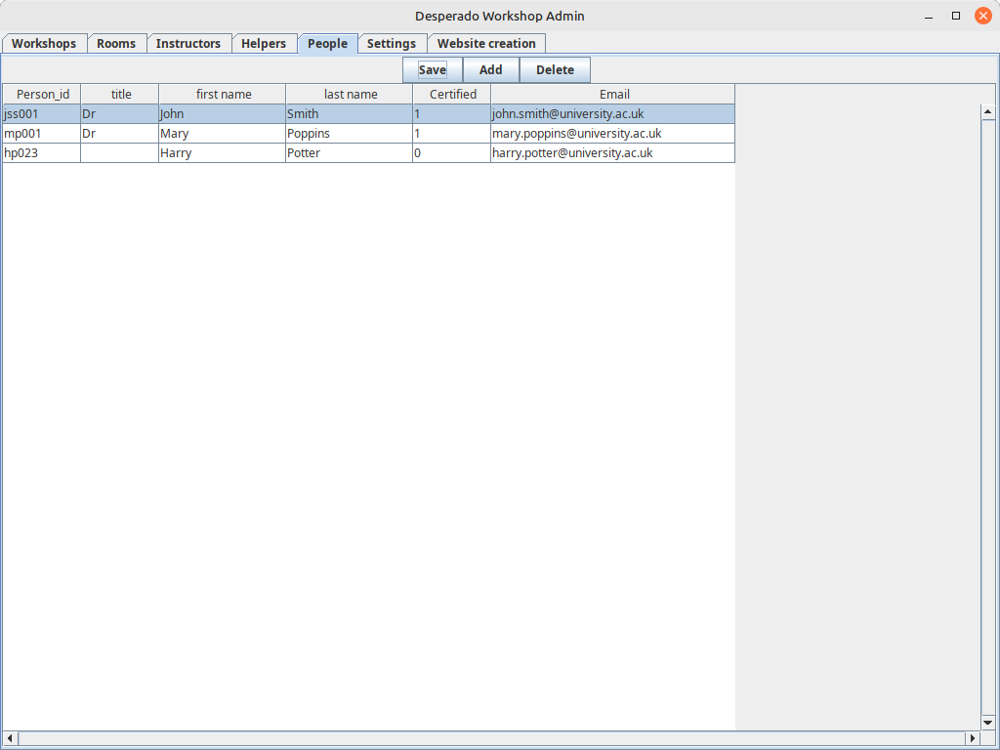
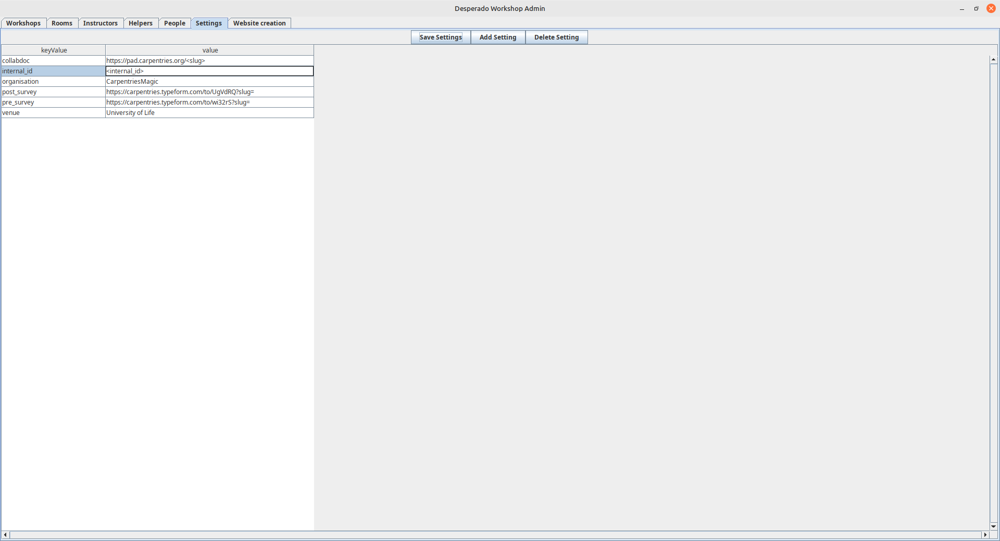
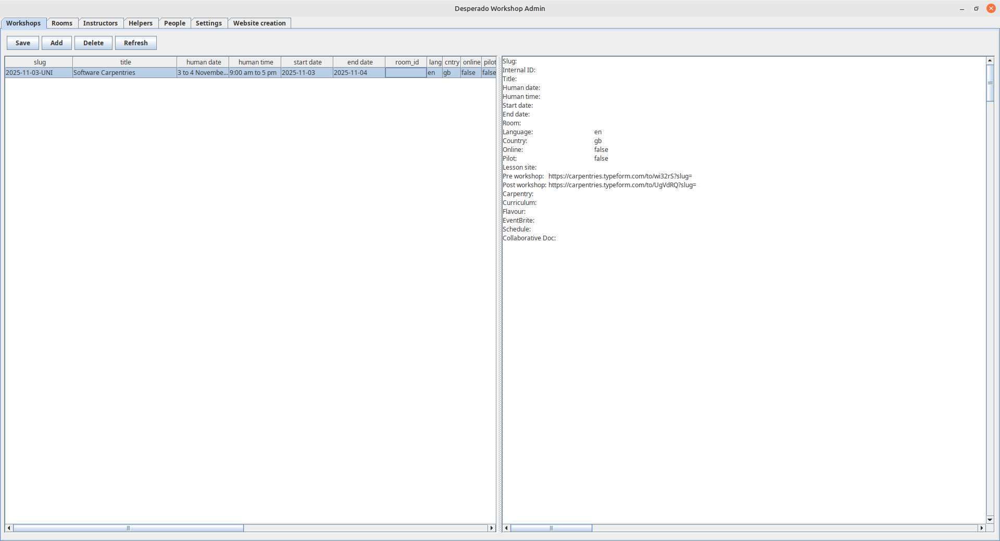
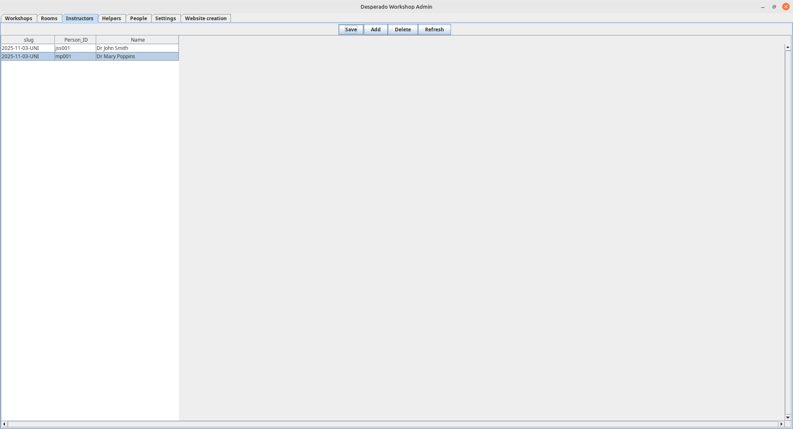
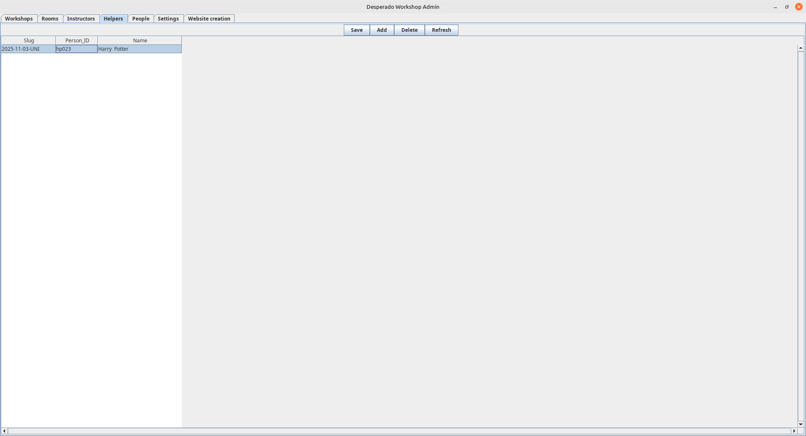
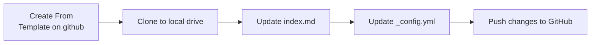
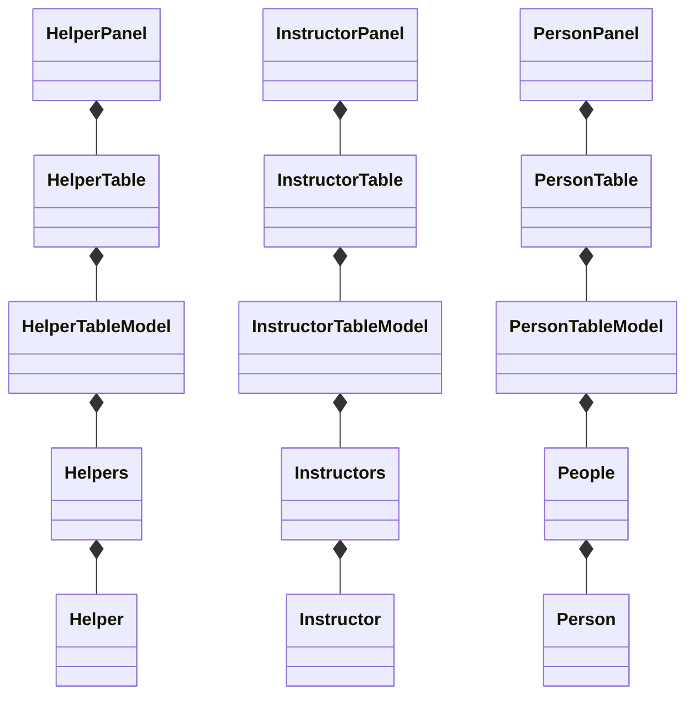
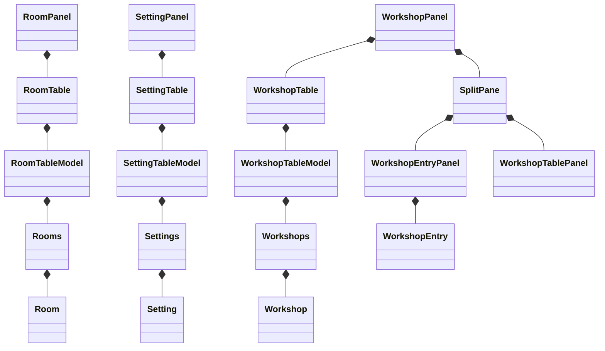
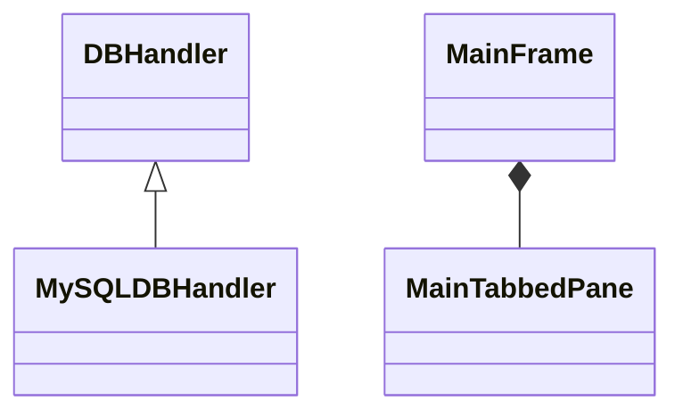

# README

This Java program provides a graphical user interface (GUI) for the workshop
management system that makes use of a database. It keeps track of workshops,
helpers, instructors and rooms. When everything is updated in the database 
the program can be used to generate a website for the workshop.

# Getting Started
Start by making sure that you have **Java 17** or later installed. You can do this
by opening a bash terminal or a command prompt and then type `java -version`.

You should get something like:
```bash
openjdk version "21.0.8" 2025-07-15
OpenJDK Runtime Environment (build 21.0.8+9-Ubuntu-0ubuntu124.04.1)
OpenJDK 64-Bit Server VM (build 21.0.8+9-Ubuntu-0ubuntu124.04.1, mixed mode, sharing)
```

## Preparing for installation

Create a directory on your hard drive into which you
can download the program. In your web browser, navigate to: 
`https://github.com/CarpentriesMagic/WorkshopAdminUI/releases`

## Download the files
Click on the little arrow to the left of the Assets heading of the
latest Automated Build. You need to download the following:
1. dwa-##.jar (replace ## with the build version)
2. emptydatabase.sqlite
3. logging.properties
4. sqlite-jdbc-3.50.3.0.jar
5. workshopadmin.properties.bu

## Complete the following steps:
1. In the same directory as the .jar file, copy emptydatabase.sqlite to data.sqlite
2. Copy workshopadmin.properties.bu to workshopadmin.properties

## Running the program

At the command prompt in the directory into which you downloaded all
the files, type (replace ## with the appropriate version number that
you downloaded):

```bash
java -cp dwa-##.jar Main
```

## Getting started

1. Add venues to you database using the `Rooms` tab. Do this first because you can't add a workshop without a venue.
2. Start by adding people to your database by using the `People` tab. Do this second because you need people to 
be able to add instructors and helpers. If a person is a certified Carpentries instructor the value in the `Certified` 
column should be one. If the person can act only as a helper (and is not certified) the value should be 0. If a person
is not active as a helper or an instructor the should be -1.
3. Make sure the settings on the `Settings` tab are correct to reflect the preferences of your organisation.
4. Next add your workshops. Each workshop is identified by a slug that comprises of `YYYY-MM-DD-ORG` where `YYYY` is the year 
of the first day of the workshop, `MM` the month and `DD` the day. `ORG` is to be replaced by the name, or abbreviation of
the name, of your organisation eg. `2025-01-10-NCL`. If the workshop is online `-online` is added to the end.
5. Before adding instructors and helpers, you need to have people and workshops added. To add instructors to a 
workshop, select the `Instructors` tab. Select the slug of the workshop and then, in the second column, select the 
person. Only people with a `Certified` value of `1` will be listed in the dropdown box.
6. To add helpers, you need to navigate to the `Helpers` tab. People with a `Certified` value of 0 and higher will be listed for
selection as helper.

### Rooms


### People


### Settings


### Workshops


### Instructors


### Helpers


## Creating a workshop website

The last tab `Website creation` has three buttons and one dropdown box:
1. The dropdown box is for selecting a workshop for which you want to create a website.
2. The `Generate` button will create a repository using the Carpentries workshop-template. The repository will be created
in the GitHub organisation which is the settings table, using the `organisation` key value.
3. The `Delete` button will delete the repository selected from the dropdown box in the organisation from the `Settings`
table
4. The `Clone` button will clone the repository created in step `2` to your local drive in the directory that you 
currently are (and most likely are running this program from). It will then update all the template values and push the
changes back to GitHub. GitHub pages will build the website and it should be availabile after a few minutes.

### Website creation workflow



# Architecture




