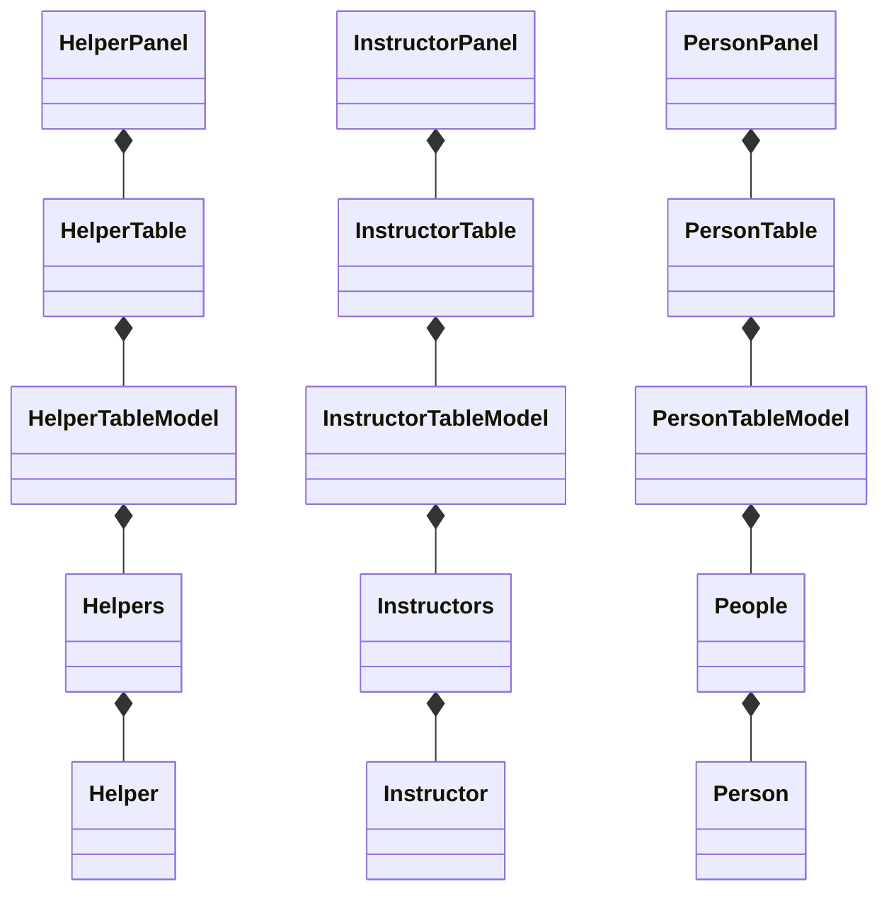
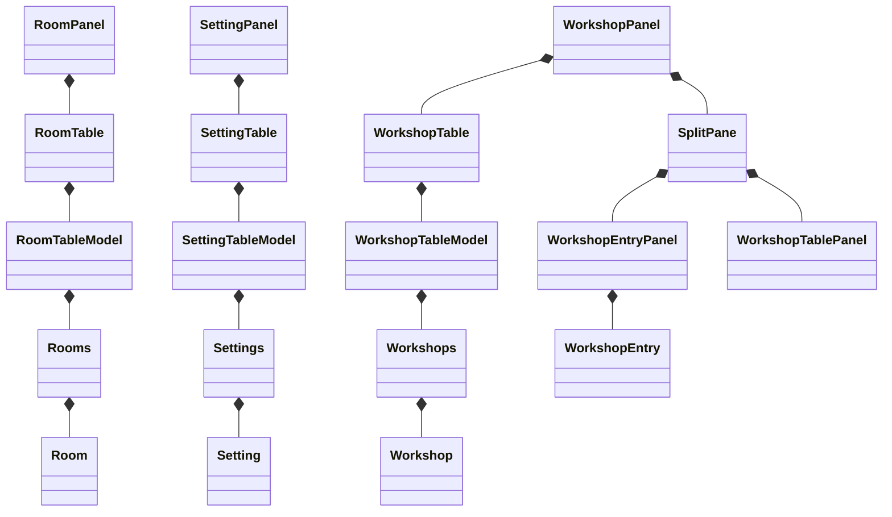
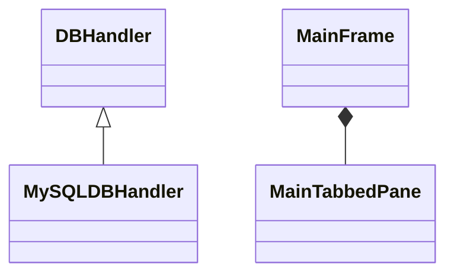

# README

This Java program provides a graphical user interface (GUI) for the workshop
management system that makes use of a database. It keeps track of workshops,
helpers, instructors and rooms. If kept up to date, it can be used to use
the CarpentriesMagic bash script to automatically generate a workshop website.

The repository for the bash script can be found here: https://github.com/CarpentriesMagic/WorkshopAdmin

# Architecture

